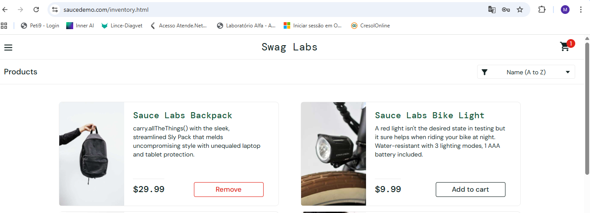
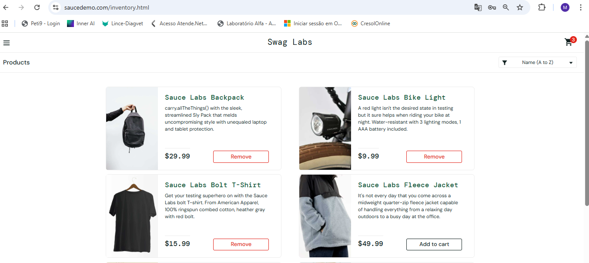
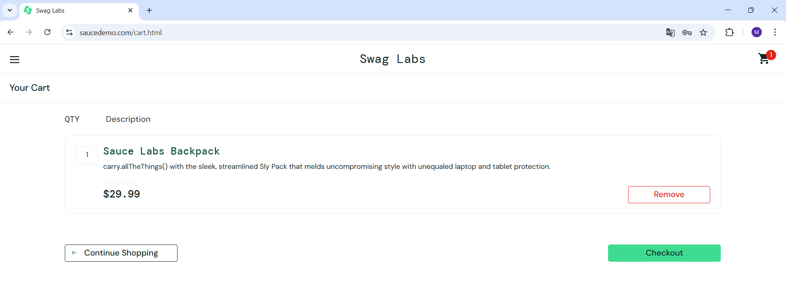
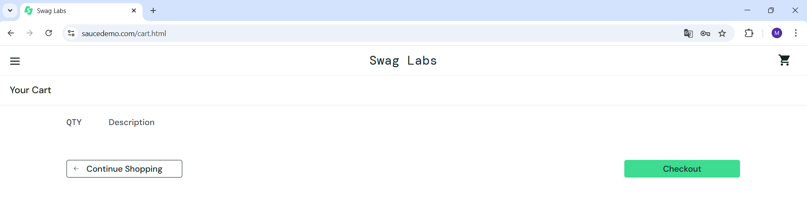

# 🧪 Kit QA — SauceDemo | Casos de Teste, Execução e Bugs

Documentação completa de testes funcionais realizados no módulo de 
**Carrinho de Compras** da aplicação [SauceDemo](https://www.saucedemo.com/), 
utilizada como ambiente de prática para QA.

---

## 📌 Sobre o projeto

Este repositório faz parte do meu portfólio como QA Analyst e tem como objetivo 
demonstrar a capacidade de planejar, documentar e executar testes manuais de forma 
estruturada, utilizando boas práticas de qualidade de software.

A aplicação testada é o **SauceDemo**, um e-commerce de demonstração amplamente 
utilizado para treinamento e prática em QA.

---

## 🗂️ O que está documentado

- **Casos de Teste** — 10 cenários funcionais cobrindo o módulo de Carrinho, 
com objetivo, pré-condições, passos detalhados, dados de teste e critério de aceite.
- **Execução de Testes** — Registro de execução por ciclo (Carrinho_1), 
com resultado, tempo, observações e rastreabilidade com os casos de teste.
- **Registro de Bugs** — 2 defeitos identificados e documentados com severidade, 
prioridade, passos para reprodução, resultado atual x esperado e evidências.

---

## 📊 Resumo da execução

| Total de Casos | Passed | Failed | Taxa de sucesso |
|:--------------:|:------:|:------:|:---------------:|
| 10             | 8      | 2      | 80%             |

---

## 🐛 Bugs encontrados

**BUG-001** — Produto não é adicionado ao carrinho pela página de detalhes  
Severidade: Média | Prioridade: Média

**BUG-002** — Botão "Continue Shopping" não redireciona o usuário  
Severidade: Baixa | Prioridade: Baixa

---

## 🖼️ Evidências de Execução

| Caso | Resultado | Evidência |
|------|-----------|-----------|
| CT-001 | ✅ Passed |  |
| CT-002 | ✅ Passed |  |
| CT-003 / BUG-001 | ❌ Failed | [▶ assistir](evidencias/CT-003-BUG-001.mp4) |
| CT-004 | ✅ Passed |  |
| CT-005 | ✅ Passed | [▶ assistir](evidencias/CT-005.mp4) |
| CT-006 | ✅ Passed |  |
| CT-007 | ✅ Passed | [▶ assistir](evidencias/CT-007.mp4) |
| CT-008 | ✅ Passed | [▶ assistir](evidencias/CT-008.mp4) |
| CT-009 | ✅ Passed | [▶ assistir](evidencias/CT-009.mp4) |
| CT-010 / BUG-002 | ❌ Failed | [▶ assistir](evidencias/CT-010-BUG-002.mp4) |

---

## 🛠️ Tecnologias e ferramentas

- Teste manual funcional
- Documentação em planilha (Excel)
- Ambiente: QA | Versão: v1.0.0
- Aplicação: [SauceDemo](https://www.saucedemo.com/)

---

## 👩‍💻 Autora

**Mariana** — QA Analyst em transição de carreira  
[LinkedIn](https://www.linkedin.com/in/mariana-schmitz-qa) | [GitHub](https://github.com/marianaschmitz95-dot)
